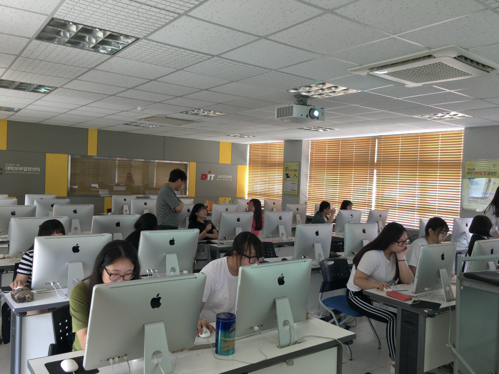

# 목차

##### 1. Swift 프로그래밍 기초

* Playground 사용하기
* 변수, 상수, 형, 형추론, 문자열 연산
* 비교연산, 제어문, 스트링 연산
* 함수, optional 변수, 형 변환 등

##### 2. 숫자 맞추기 게임 만들기
* Playground로 만들기
* Command Line Tool로 만들기
* 업그레이드 하기

##### 3. iOS 앱 프로그래밍 기초

* XCode 사용하기
* Hello iPhone 앱 만들기 : StoryBoard 사용하기
* 상호작용 앱\(Button Fun\) 앱 만들기 : IBOutlet 변수, IBAction 함수 이해 및 활용하기
* 프로그래밍 문제 해결 : Button Fun 앱 기능 추가하기

##### 4. Tap Me 게임 제작

* 다함께 Tap Me 게임 이해 및 제작
* UILabel, UIButton, NSTimer, UIAlertView 객체 이해 및 활용하기
* 게임 알고리즘 이해하기

##### 5. 기초 프로젝트 제작 및 발표 : 2인 1조 혹인 1인

* Tap Me 게임의 기능 추가

##### 참고 자료

* [https:/www.raywenderlich.com/114148/learn-to-code-ios-apps-with-swift-tutorial-1-welcome-to-programming](https://www.raywenderlich.com/114148/learn-to-code-ios-apps-with-swift-tutorial-1-welcome-to-programming)
* [http:/www.raywenderlich.com/5600/ios-for-high-school-students-getting-started](http://www.raywenderlich.com/5600/ios-for-high-school-students-getting-started)
  [http:/www.raywenderlich.com/11079/ios-for-high-school-students-text-adventure-game](http://www.raywenderlich.com/11079/ios-for-high-school-students-text-adventure-game)
* [http:/www.raywenderlich.com/25561/ios-for-high-school-students-making-your-first-ios-app-part-1](http://www.raywenderlich.com/25561/ios-for-high-school-students-making-your-first-ios-app-part-1)
* [http:/www.raywenderlich.com/27191/ios-for-high-schoolers-making-your-own-ios-app-part-2](http://www.raywenderlich.com/27191/ios-for-high-schoolers-making-your-own-ios-app-part-2)

