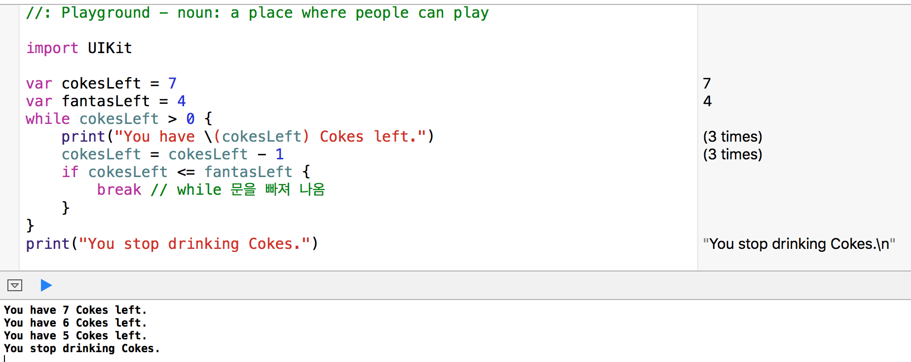

# Day 1
#### Playground


####변수\(Variable\),  상수\(Constants\)

변수는 저장한 값이 변경될 수 있고, 상수는 저장한 값이 변경될 수 없다.
변수는 `let`, 상수는 `var`로 표시한다.

```swift
import UIKit 
var str = "Hello, playground"                                                                                                             
```
```Swift
// 계산기                                                                                                                 
import UIKit
2 + 2       
```

#### 변수(Variables) 

값을 저장하기 위해 변수를 사용한다. 변수를 만들기 위해서는다음과 같은 문법을 사용한다.

```Swift
var yourVariableName: yourType = YourInitialValue
```

```Swift
var str: String = "안녕 삼정고 여러분!"
var age: Int = 18
```

####형(Types)
* `Int` - 정수형, 예) `12`
* `Double` - 실수형, 예) `12.04`
* `Bool` - 불형 예) 값이 `true` 혹은 `false` 
* `String` - 문자열, 예) `"우리는 멋진 삼정고"`

```Swift
var luckyNumber: Int = 7
var costOfCandy: Double = 1.25
var hungry: Bool = true
var name: String = "Steve Jobs"
```

```Swift
var name: String = "Steve Jobs"
name = "Mark Zuckerberg"
```

####상수(Constants)
변수의 특별한 한 형태를 상수라고 한다. 상수는 저정한 값을 바꿀 수가 없게 한다. 변수와 마찬가지로 어떤 형도 상수가 될 수 있다.

```Swift
let myAge: Int = 27
let pi: Double = 3.14
let canTouchThis: Bool = false
let teacher: String = "홍길동"

teacher = "임꺽정" // 오류가 발생함?
```

####형 추론(Inferred Typing)
```Swift
var luckyNumber: Int = 7
var luckyNumber = 7
```

``` Swift
// luckyNumber를 Double로 명시적으로 표현하면 7.0으로 초기화해야 함
var luckyNumber: Double = 7.0
```

```Swift
// 형추론 형식으로 표현
var luckyNumber = 7
var costOfCandy = 1.25
var hungry = true
var name = "Steve Jobs"
name = "Mark Zuckerberg"

let myAge = 27
let pi = 3.14
let canTouchThis = false
let teacher = "홍길동"
```

####비교 연산(Comparision Operators)
* **`>`**   Greater Than
* **`<`**   Less Than
* **`==`**   Equal To
* **`>=`**   Greator Than or Equal To
* **`&&`**   AND
* **`||`**   OR 


####if/ else 문

```Swift
var bookPrice = 1000
if bookPrice >= 999 {
  print("Hey, the book is epensive")
} else {
  print("OK, I can affort")
}
```


####간단한 함수(Functions)
* 내가 만드는 함수


* 라이브러리 함수(불러서 사용하는 함수)

```swift
let batmanCoolness = 7
print("Hello iPhone")
print("Swift is awesome")
print(batmanCoolness)
```


####스트링 연산

```Swift
let title = "Hi, Swift"
let review = "Is Awesome!"
let description = title + " - " + review
// description = "Hi, Swift  - Is Awesome!"
print(description)
```

``` Swift
var apples = 5
print("I have \(apples) apples")
print("You have \(apples - 5) apples")
```

```Swift
var kimGrade = 95
var leeGrade = 82
if kimGrade < leeGrade {
  print("\(kimgrade) is less than \(leeGrade)")
} else if kimGrade > leeGrade {
  print("\(kimGrade is greater than \(leeGrade)")
} else {
  print("\(kimGrade) is equal to \(leeGrade)")
}
```

####For 루프
 


####While 루프

```Swift
var secondsLeft = 3
while secondsLeft > 0 {
  print(secondsLeft)
  secondsLeft = secondsLeft - 1
}
print("Yay! the end")
```


####Break 문


####Continue 문


#### Optional 변수
변수가 값을 가지고 있는지 그렇지 않는지 알 수가 없다. 이때 변수가 값을 가지고 있지 않는 경우 `nil` 값을 가지고 있다고 한다. `Optiona`l 변수는 값이나 `nil` 두가지 중 하나를 가질 수 있는 특수한 변수이다. `Swift`에서는 일반 변수는 `nil` 값을 가질 수 없다.

```Swift
var optionalNumber: Int? = 5
optionalNumber = nil
```

```Swift
if let number = optionalNumber {
  print("It is a number")
} else {
  print("It is not a number) // nil 값을 가지고 있음
}
```

#### 형변환

```Swift
var languagesLearned: String = "3"
var languageLearnedNum: Int? = Int(languageLearned)
```

```Swift
if let num = languageLearnedNum {
  print("It is a number")
} else {
  print("nil 값임")
}
```


####참고 
https:www.raywenderlich.com/114148/learn-to-code-ios-apps-with-swift-tutorial-1-welcome-to-programming

