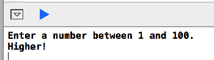
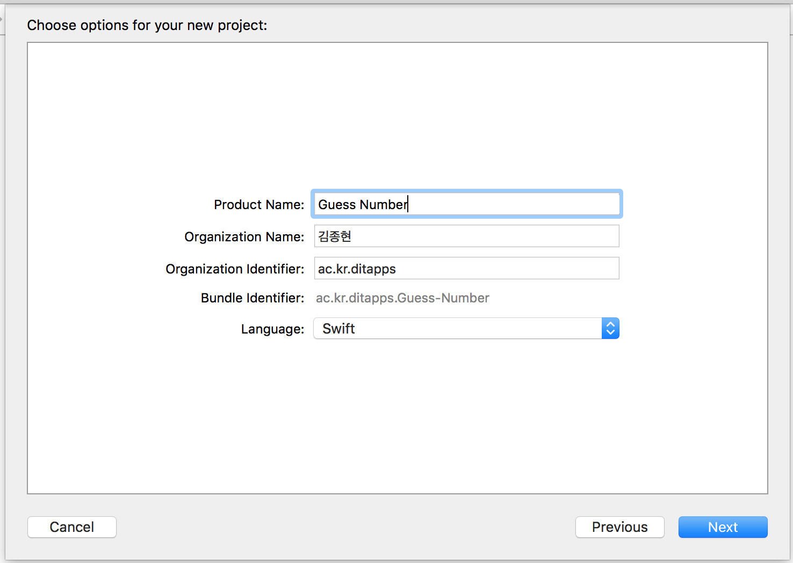
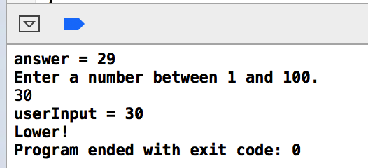
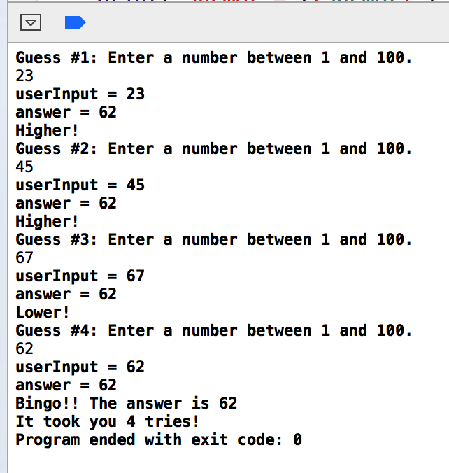

# Day 2

#### 숫자 맞추기 게임 만들기 01 (Playground)

```Swift
//: Playground - noun: a place where people can play
// Guess Number 01

import UIKit
import Foundation

func randomIntBetween(low:Int, high:Int) -> Int {
    let range = high - (low - 1)

    // acr4Random 함수는 2~2exp32까지 숫자는 랜덤으로 생성
    return (Int(arc4random()) % range + (low - 1))
}

let answer = randomIntBetween(1, high: 100)

print("Enter a number between 1 and 100.")

var guess = 21

if guess > answer {
    print("Lower!")
} else if guess < answer {
    print("Higher!")
} else {
    print("Bingo!! The answer is \(answer)")
}
```


#### 숫자 맞추기 게임 만들기 02 (Command Line Tool) 

 


```Swift
//  main.swift
//  Guess Number 02

import Foundation

let answer = randomIntBetween(1, high: 100)
print("answer = \(answer)")

print("Enter a number between 1 and 100.")

let userInput = input()

print("userInput = \(userInput)")

let inputAsInt = Int(userInput)

if let guess = inputAsInt {

    if inputAsInt > answer {
        print("Lower!")
    } else if inputAsInt < answer {
        print("Higher!")
    } else {
        print("Bingo!! The answer is \(answer)")
    }
} else {
    print("Invaild input! Please enter a number.")
}
```

####[`helper.swift` 소스 다운로드](https://dl.dropboxusercontent.com/u/11130733/helpers.swift)#####

```Swift
//  My First Project

import Foundation

func input() -> String {
  let keyboard = NSFileHandle.fileHandleWithStandardInput()
  let inputData = keyboard.availableData
  let rawString = NSString(data: inputData, encoding:NSUTF8StringEncoding)
  
  if let string = rawString {
    return string.stringByTrimmingCharactersInSet(NSCharacterSet.whitespaceAndNewlineCharacterSet())
  } else {
    return "Invalid input"
  }
}

func randomIntBetween(low:Int, high:Int) -> Int {
  let range = high - (low - 1)
  return (Int(arc4random()) % range) + (low - 1)
}
```




####숫자 맞추기 게임 만들기 03 (Command Line Tool)
```Swift
//  main.swift
//  Guess Number 03

import Foundation

let answer = randomIntBetween(1, high: 100)
var turn = 1

while true {
    
    print("Guess #\(turn): Enter a number between 1 and 100.")
    
    let userInput = input()
    
    print("userInput = \(userInput)")
    print("answer = \(answer)")
    
    let inputAsInt = Int(userInput)

    if let guess = inputAsInt {

        if guess > answer {
            print("Lower!")
        } else if guess < answer {
            print("Higher!")
        } else {
            print("Bingo!! The answer is \(answer)")
            break
        }
    } else {
        print("Invaild input! Please enter a number.")
        continue
    }
    turn = turn + 1
}

print("It took you \(turn) tries!")
```

