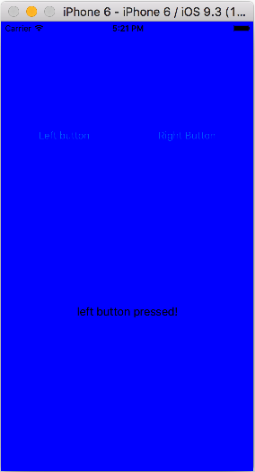

# Day 3

#### XCode iOS Project 만들기


#### Hello World 앱 만들기
 
 * `IBOutlet` 변수
 * `IBAction` 함수


 
  
 
 


```Swift
//  ViewController.swift
//  Hello World

import UIKit

class ViewController: UIViewController {

    @IBOutlet weak var myLabel: UILabel!
    
    @IBAction func buttonPressed(sender: AnyObject) {
        print("button pressed!")
        
        let inputStr = "button pressed"
        myLabel.text = inputStr
    
    }
    override func viewDidLoad() {
        super.viewDidLoad()
        // Do any additional setup after loading the view, typically from a nib.
    }

    override func didReceiveMemoryWarning() {
        super.didReceiveMemoryWarning()
        // Dispose of any resources that can be recreated.
    }

}
```

#### 프로그래밍 문제 : Button Fun 앱 만들기

* 
프로그램을 처음 실행하면 view의 색깔이 노란색`UIColor.yellowColor()` 나타난다. 

* 
`Left button`을 누르면 view의 색깔이 파란색`UIColor.blueColor()`으로 바뀌고, label에는 `"Left button pressed"` 스트링이 출력된다.

* 
`Right button`을 누르면 view의 색깔이 초록색`UIColor.greenColor()`으로 바뀌고, label에는 `"Right button pressed"` 스트링이 출력된다.

  

