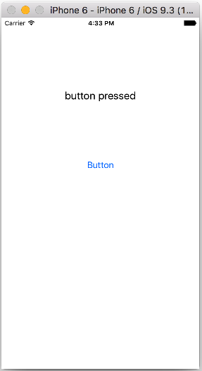

# Day 3

#### Hello World 앱 만들기
 
  
 
 


```Swift
//  ViewController.swift
//  Hello World

import UIKit

class ViewController: UIViewController {

    @IBOutlet weak var myLabel: UILabel!
    
    @IBAction func buttonPressed(sender: AnyObject) {
        print("button pressed!")
        
        let inputStr = "button pressed"
        myLabel.text = inputStr
    
    }
    override func viewDidLoad() {
        super.viewDidLoad()
        // Do any additional setup after loading the view, typically from a nib.
    }

    override func didReceiveMemoryWarning() {
        super.didReceiveMemoryWarning()
        // Dispose of any resources that can be recreated.
    }

}
```

#### Storyboard를 사용한 ButtonFun 앱 만들기

