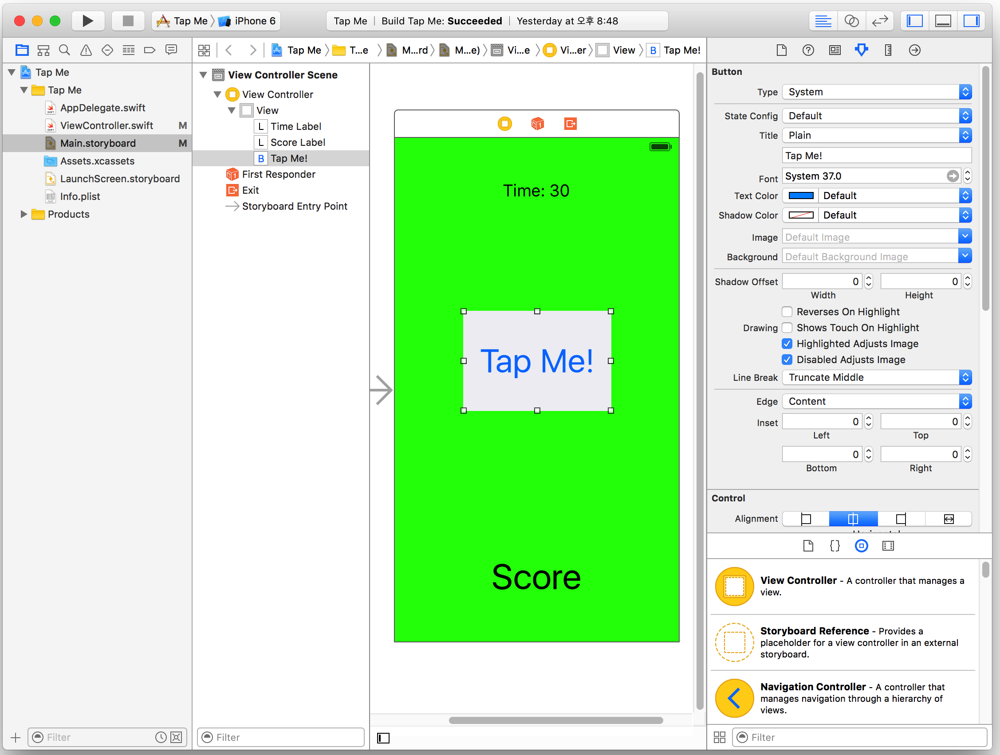

# Day 4

#### Tap Me 게임 만들기 
 



```Swift
//  ViewController.swift
//  Tap Me 01
import UIKit

// 게임의 버튼 터치 횟수를 저장하는 변수
var count = 0

// 현재의 time을 저장할 변수
var seconds = 0


class ViewController: UIViewController {

    @IBOutlet weak var timeLabel: UILabel!
    @IBOutlet weak var scoreLabel: UILabel!
    
    // timer 객체 생성
    var timer = NSTimer()
    
    // 게임의 작동과 정지를 타나내는 bool 형 변수
    var stopFlag = true
    
    @IBAction func buttonPressed(sender: AnyObject) {
        
        // stopFlag가 true이면 게임 작동, false이면 게임 중지(stop)
        if stopFlag == true {
            print("Button pressed")
            count = count + 1
            scoreLabel.text = "Score \n\(count)"
        } else {
            print("Stop button press!")
            scoreLabel.text = "Score \n\(count)"
        }
    }
    
    override func viewDidLoad() {
        super.viewDidLoad()
        // Do any additional setup after loading the view, typically from a nib.
        setupGame()
    }
    
    func setupGame() {
        // 게임 시가늘 10초로 설정
        seconds = 10
        count = 0
        timeLabel.text = "Time: \(seconds)"
        scoreLabel.text = "Score: \(count)"
        
        // timer 실행 및 subtractTime() 함수를 1.0초 마다 주기적으로 호출
        timer = NSTimer.scheduledTimerWithTimeInterval(1.0, target: self, selector: #selector(ViewController.subtractTime), userInfo: nil, repeats: true)
    }
    
    func subtractTime() {
        seconds = seconds - 1
        
        timeLabel.text = "Time: \(seconds)"
        
        if seconds == 0 {
            // timer를 stop 함
            timer.invalidate()
            
            stopFlag = false
        }
    }
}


```


