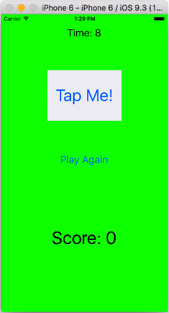
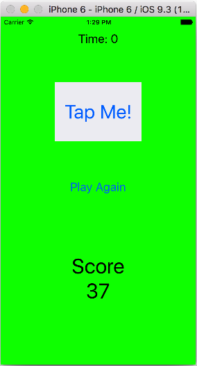
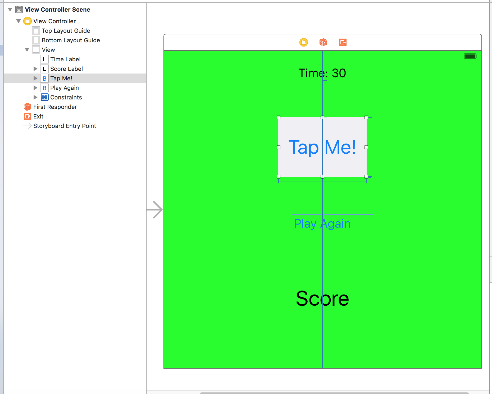
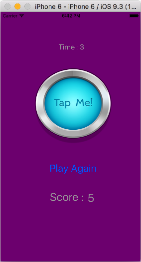
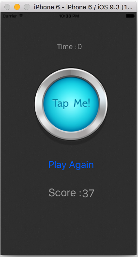
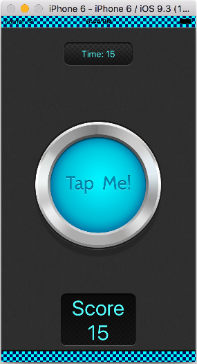
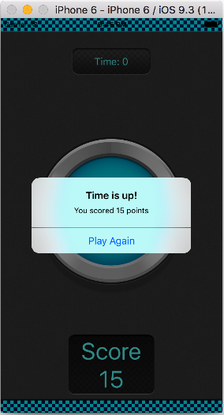

# Day 5

####Tap Me 게임 업그레이드 하기

  



```Swift
//  ViewController.swift
//  Tap Me 02

import UIKit

// 버튼 touch 누적 횟수를 저장할 변수
var count = 0

// 현재의 time을 저장할 변수
var seconds = 0

class ViewController: UIViewController {

    @IBOutlet weak var timeLabel: UILabel!
    @IBOutlet weak var scoreLabel: UILabel!
    
    // timer 객체 생성
    var timer = NSTimer()
    var stopFlag = true
    
    @IBAction func buttonPressed(sender: AnyObject) {
        
        if stopFlag == true {
            print("Button pressed")
            count = count + 1
            scoreLabel.text = "Score \n\(count)"
        } else {
            print("Stop button press!")
            scoreLabel.text = "Score \n\(count)"
        }
    }
    
    @IBAction func playAgainButtonPressed(sender: AnyObject) {
        
        setupGame()
        stopFlag = true
    }
    
    
    func setupGame() {
        seconds = 10
        count = 0
        timeLabel.text = "Time: \(seconds)"
        scoreLabel.text = "Score: \(count)"
        
        // timer 실행 및 subtractTime() 함수를 주기적으로 호출
        timer = NSTimer.scheduledTimerWithTimeInterval(1.0, target: self, selector: #selector(ViewController.subtractTime), userInfo: nil, repeats: true)
    }
    
    func subtractTime() {
        seconds = seconds - 1
        timeLabel.text = "Time: \(seconds)"
        
        if seconds == 0 {
            // timer를 stop 함
            timer.invalidate()
            
            stopFlag = false
            //scoreLabel.text = "Score: \(count)"
            
            /* Alert View로 게임 결과 표시 및 게임 재시작
            let alert = UIAlertController(title: "Time is end!", message: "You scored \(count) point", preferredStyle: UIAlertControllerStyle.Alert)
            
            alert.addAction(UIAlertAction(title: "Play again", style: UIAlertActionStyle.Default, handler: {
                action in self.setupGame()
            }))
            
            presentViewController(alert, animated: true, completion: nil)
            */ 
        }
    }
}

```
####[버튼 이미지 다운로드 ](https://dl.dropboxusercontent.com/u/11130733/button_tap_selected.png)####

  


####[최종 프로젝트 소스 다운로드](https://dl.dropboxusercontent.com/u/11130733/Tap%20Me%20Game%20Final.zip)####


 

####참고

https://www.raywenderlich.com/114298/learn-to-code-ios-apps-with-swift-tutorial-5-making-it-beautiful

